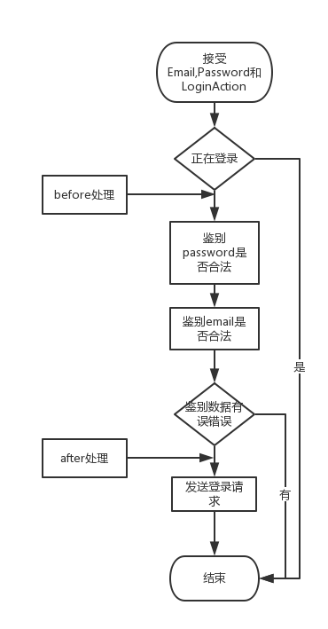

# Android中的MVVM

这一节我们来看看如何在Android的项目中运用MVVM。
先来看看Android中的MVC层级。我们在使用IDE创建一个Activity时，会默认帮我们创建一个xml布局文件。而我们从这两个文件的职责可以看出，Activity相当于Controller，xml布局文件相当于View。


明确层级关系后作为一个程序员，来通过经典的```Hello World```来演示一下，如何将MVC中的Controller的部分功能移植到MVVM中的ViewModel中。

###不一样的Hello World


如图一个登录界面，用户通过邮箱和密码进行登录验证，下面的登录按钮，需要等到email与password全部有输入后才会显示出来, 登录成功后显示用户的token，还有我们必不可少的```Hello World```。
我们可以先来看下符合MVC原则的原始部分代码。

###MVC代码
* Model:User类用来存储用户登陆后的信息数据。
```
public class User {
    private String email;//用户名email
    private String token;//登陆返回的token
    
    省略getter和setter方法
}
```
* View: Android中主要是由xml文件来充当View显示布局。下面是登录显示界面布局

```
<LinearLayout xmlns:android="http://schemas.android.com/apk/res/android"
    xmlns:tools="http://schemas.android.com/tools"
    android:layout_width="match_parent"
    android:layout_height="match_parent"
    android:gravity="center_horizontal"
    android:orientation="vertical"
    android:paddingBottom="@dimen/activity_vertical_margin"
    android:paddingLeft="@dimen/activity_horizontal_margin"
    android:paddingRight="@dimen/activity_horizontal_margin"
    android:paddingTop="@dimen/activity_vertical_margin"
    tools:context="com.xuanpeng.mvvmsamplechapter1.LoginActivity">

    <!-- Login progress -->
    <ProgressBar
        android:id="@+id/login_progress"
        style="?android:attr/progressBarStyleLarge"
        android:layout_width="wrap_content"
        android:layout_height="wrap_content"
        android:layout_marginBottom="8dp"
        android:visibility="gone"/>

    <ScrollView
        android:id="@+id/login_form"
        android:layout_width="match_parent"
        android:layout_height="match_parent">

        <LinearLayout
            android:id="@+id/email_login_form"
            android:layout_width="match_parent"
            android:layout_height="wrap_content"
            android:orientation="vertical">

            <android.support.design.widget.TextInputLayout
                android:layout_width="match_parent"
                android:layout_height="wrap_content">

            <AutoCompleteTextView
                android:id="@+id/email"
                android:layout_width="match_parent"
                android:layout_height="wrap_content"
                android:hint="@string/prompt_email"
                android:inputType="textEmailAddress"
                android:maxLines="1"
                android:singleLine="true"/>

            </android.support.design.widget.TextInputLayout>

            <android.support.design.widget.TextInputLayout
                android:layout_width="match_parent"
                android:layout_height="wrap_content">

            <EditText
                android:id="@+id/password"
                android:layout_width="match_parent"
                android:layout_height="wrap_content"
                android:hint="@string/prompt_password"
                android:imeActionId="@+id/login"
                android:imeActionLabel="@string/action_sign_in_short"
                android:imeOptions="actionUnspecified"
                android:inputType="textPassword"
                android:maxLines="1"
                android:singleLine="true"/>

            </android.support.design.widget.TextInputLayout>

            <Button
                android:id="@+id/email_sign_in_button"
                style="?android:textAppearanceSmall"
                android:layout_width="match_parent"
                android:layout_height="wrap_content"
                android:layout_marginTop="16dp"
                android:text="@string/action_sign_in"
                android:textStyle="bold"/>
            <TextView
                android:layout_width="match_parent"
                android:layout_height="wrap_content"
                android:textColor="@color/colorAccent"
                android:textSize="30sp"
                android:id="@+id/token_show_text_view"/>
        </LinearLayout>
    </ScrollView>
</LinearLayout>
```
* Controller 中的代码比较多，大概在260行左右，其中包含了呈现View，获取用户交互，控制View的显示逻辑和登录网络请求等。


#### 先看看私有属性：
```
    /**
     * 登录请求Task，用于异步登录
     */
    private UserLoginTask mAuthTask = null;

    // 显示UI组件
    private AutoCompleteTextView mEmailView;
    private EditText mPasswordView;
    private View mProgressView;
    private View mLoginFormView;
    private Button mEmailSignInButton;
    private TextView mTokenTextView;

    //两个状态值，用于监听有没有文本输入
    private  boolean mhasEmailText = false;
    private  boolean mhasPasswordText = false;

    //存储登录成功后的数据
    private User loginUser = null;
```
其中根据两个状态值来控制登录按钮的显示。[UserLoginTask](./android_zhong_de_mvvm.md#私有类型userlogintask)是一个私有类，用于发送异步登录操作，并返回登录结果。

#### 接下来看看私有函数：

 其中分为三个**辅助函数**```isEmailValid, isPasswordValid, md5```,用于邮箱和密码的合法性认证，以及模拟生成token。
 
两个界面**处理函数**,
```
    /**
     * 根据两个状态值来控制登录按钮的显示
     */
    private void updateSignButton() {
        mEmailSignInButton.setVisibility(mhasEmailText&&mhasPasswordText ? View.VISIBLE : View.GONE);
    }
    /**
     * 登录时，显示Loading界面
     */
    private void showProgress(final boolean show) {
        ...
    }
```
一个**功能函数**，用于输入验证与发起异步登录请求。
```
private void attemptLogin() {
        if (mAuthTask != null) {
            return;
        }

        // Reset errors.
        mEmailView.setError(null);
        mPasswordView.setError(null);

        // Store values at the time of the login attempt.
        String email = mEmailView.getText().toString();
        String password = mPasswordView.getText().toString();

        boolean cancel = false;
        View focusView = null;

        // Check for a valid password, if the user entered one.
        if (!TextUtils.isEmpty(password) && !isPasswordValid(password)) {
            mPasswordView.setError(getString(R.string.error_invalid_password));
            focusView = mPasswordView;
            cancel = true;
        }

        // Check for a valid email address.
        if (TextUtils.isEmpty(email)) {
            mEmailView.setError(getString(R.string.error_field_required));
            focusView = mEmailView;
            cancel = true;
        } else if (!isEmailValid(email)) {
            mEmailView.setError(getString(R.string.error_invalid_email));
            focusView = mEmailView;
            cancel = true;
        }

        if (cancel) {
            // There was an error; don't attempt login and focus the first
            // form field with an error.
            focusView.requestFocus();
        } else {
            // Show a progress spinner, and kick off a background task to
            // perform the user login attempt.
            showProgress(true);
            mAuthTask = new UserLoginTask(email, password);
            mAuthTask.execute((Void) null);
        }
    }
```
#### 私有类型UserLoginTask

用于模拟异步网络请求登录，并返回token数据，用于界面显示token。
```
    private class UserLoginTask extends AsyncTask<Void, Void, User> {

        private final String mEmail;
        private final String mPassword;

        UserLoginTask(String email, String password) {
            mEmail = email;
            mPassword = password;
        }

        @Override
        protected User doInBackground(Void... params) {
            // TODO: attempt authentication against a network service.

            User user = null;
            try {
                // Simulate network access.
                Thread.sleep(2000);
                //模拟登录成功，返回user对象
                user = new User();
                user.setEmail(mEmail);
                user.setToken(md5(mEmail));
            } catch (InterruptedException e) {
                return null;
            }


            // TODO: register the new account here.
            return user;
        }

        @Override
        protected void onPostExecute(final User user) {
            mAuthTask = null;
            showProgress(false);

            if (user!=null) {
                mTokenTextView.setText(user.getToken()+"\nHello World");
            } else {
                mPasswordView.setError(getString(R.string.error_incorrect_password));
                mPasswordView.requestFocus();
            }
        }

        @Override
        protected void onCancelled() {
            mAuthTask = null;
            showProgress(false);
        }
    }
```

#### 别忘了我们的初始化函数OnCreate
初始化函数中，我们将获取view中的各个组件，并加入些监听事件来监听View的交互事件,这边主要是Email与Password的输入事件与登录按钮的触发事件。
```
            @Override
            public void onTextChanged(CharSequence s, int start, int before, int count) {
                mhasEmailText = !TextUtils.isEmpty(s);
                updateSignButton();
            }
```

噢，天哪，贴了那么多代码，只是为了完成一个简单的登录操作，而且界面逻辑与业务逻辑混杂在一起，根本很难测试。可以看到现在的Controller就是一个功能繁杂的胖子。那么接下来我们就来拿上MVVM来给这个胖家伙来抽脂吧。

###准备工作
在抽脂之前，我们需要明确一下需要抽取哪些部位。根据上一章，我们可以将有关Model的业务层抽离到ViewModel层。
那么我们可以从私有属性入手，将与View没有关联的属性抽出。```mAuthTask```和```loginUser```满足这个条件。接下来我们可以将这两个属性相关的函数和类对象抽离出来，可以满足的函数有辅助函数```isEmailValid, isPasswordValid, md5```，功能函数```attemptLogin```和一个私有内部类```UserLoginTask```。

明确的各个部位，那么接下来的抽脂即将开始。首先我们先创建一个LoginViewModel类，来处理有关Model的业务层，对Controller完全封装User模型。

###辅助函数
辅助函数相对于各层次的耦合度比较低，完全可以复制到ViewModel中（实际项目中，最好放在工具类中，方便全项目使用）。

###功能函数
```attemptLogin``` 中掺杂着业务逻辑与View的界面操作代码，那就意味着这个函数的界面与业务的耦合度很高。我们的目的是将View操作与业务逻辑分离。幸好Java中我们可以将业务逻辑代码移植到ViewModel中，使用interface来将View操作的代码暴露给Controller使用，也可以理解为对外部提供hooks用于View的处理。
* 先来看下Interface的定义：


``` 
public interface LoginAction {
        public static int LoginActionErrorEmail = -1001;
        public static int LoginActionErrorPassword = -1002;

        //登录前准备函数
        void before();

        //登录准备后函数
        void after(boolean isSuccess, Error error);

        //登录完成函数
        void finished(boolean isSuccess, Error error);

        //登录取消函数
        void onCancelled();
    }
```
LoginAction中的定义了两个错误类型值与四个用于外部处理的hooks（这里主要用于通知Controller做界面变换）。

* ```attemptLogin```流程


流程图胜于千言万语。


正如图所示在鉴别与发送登录请求时，我们对外调用了```before```与```after```处理，来让外部处理相关阶段的逻辑。函数开始时，接收email，password和LoginAction三个参数，其中LoginAction就是对外提供的hook,同时将函数更改成public。具体代码如下：
```
 public void attemptLogin(String email, String password, LoginAction action) {

        if (mAuthTask != null) {
            return;
        }

        action.before();

        boolean cancel = false;
        Error error = null;//存储错误信息

        // Check for a valid password, if the user entered one.
        if (!TextUtils.isEmpty(password) && !isPasswordValid(password)) {
            error = new Error(getString(R.string.error_invalid_password), LoginAction.LoginActionErrorPassword);
            cancel = true;
        }

        // Check for a valid email address.
        if (TextUtils.isEmpty(email)) {
            error = new Error(getString(R.string.error_field_required), LoginAction.LoginActionErrorEmail);
            cancel = true;
        } else if (!isEmailValid(email)) {
            error = new Error(getString(R.string.error_invalid_email), LoginAction.LoginActionErrorEmail);
            cancel = true;
        }

        action.after(!cancel, error);

        if (!cancel) {
            //开始异步登录
            mAuthTask = new UserLoginTask(email, password, action);
            mAuthTask.execute((Void) null);
        }
    }
```

### UserLoginTask私有类
在```attemptLogin```最后，我们发送了一个UserLoginTask的异步请求来处理网络登录问题。在原有的代码中，UserLoginTask也是掺杂着View与业务逻辑代码，同样的我们可以使用Interface来对它进行改造移植。

其中UserLoginTask本身就是一个业务处理类，所以没有必要对外公开，是一个私有类以及```mAuthTask```私有变量。具体代码如下：
```
 private class UserLoginTask extends AsyncTask<Void, Void, User> {

        private final String mEmail;
        private final String mPassword;
        private final LoginAction mAction;
        UserLoginTask(String email, String password, LoginAction action) {
            mEmail = email;
            mPassword = password;
            mAction = action;
        }

        @Override
        protected User doInBackground(Void... params) {
            User user = null;
            try {
                // Simulate network access.
                Thread.sleep(2000);
                //模拟登录成功，返回user对象
                user = new User();
                user.setEmail(mEmail);
                user.setToken(md5(mEmail));
            } catch (InterruptedException e) {
                return null;
            }
            return user;
        }

        @Override
        protected void onPostExecute(final User user) {
            mAuthTask = null;

            Boolean hasError = false;
            Error error = null;


            if (user!=null) {
                LoginViewModel.this.loginUser = user;
                LoginViewModel.this.setToken(user.getToken());
            } else {
                error = new Error(getString(R.string.error_incorrect_password), LoginAction.LoginActionErrorPassword);
                hasError = true;

            }

            mAction.finished(!hasError, error);
        }

        @Override
        protected void onCancelled() {
            mAuthTask = null;
            mAction.onCancelled();
        }
    }
```

###添加显示属性
ViewModel中用于对外显示的属性主要是用户登录成功后格式化后的token。
```
 //登录成功后界面显示的toke
    private String token;
    public String getToken() {
        return token;
    }

    protected void setToken(String token) {
        if (token.isEmpty()) {
            this.token = token;
        } else {
            //token 不为空的话，添加Hello World文本
            this.token = token+"\nHello World";
        }
    }
```

到这里我们将Controller中的业务逻辑部分完全移植到ViewModel中，接下来我们只要在Controller中将View与ViewModel进行连接就可以了。
主要是在```onCreate```中new出LoginViewModel对象。并实现调用ViewModel中```attemptLogin```后的LoginAction。
```
 viewModel.attemptLogin(mEmailView.getText().toString(), mPasswordView.getText().toString(),
                new LoginViewModel.LoginAction() {
                    @Override
                    public void before() {
                        // Reset errors.
                        mEmailView.setError(null);
                        mPasswordView.setError(null);
                    }

                    @Override
                    public void after(boolean isSuccess, com.xuanpeng.mvvmsamplechapter1.model.Error error) {
                        if (isSuccess) {
                            // Show a progress spinner, and kick off a background task to
                            // perform the user login attempt.
                            showProgress(true);
                        } else  {
                            // There was an error; don't attempt login and focus the first
                            // form field with an error.
                            if (error.getCode() == LoginActionErrorEmail) {
                                mEmailView.setError(error.getMessage());
                                mEmailView.requestFocus();
                            } else  {
                                mPasswordView.setError(error.getMessage());
                                mPasswordView.requestFocus();
                            }
                        }
                    }

                    @Override
                    public void finished(boolean isSuccess, Error error) {
                        showProgress(false);
                        if (isSuccess) {
                            mTokenTextView.setText(LoginActivity.this.viewModel.getToken());
                        } else {
                            mPasswordView.setError(error.getMessage());
                            mPasswordView.requestFocus();
                        }
                    }

                    @Override
                    public void onCancelled() {
                        showProgress(false);
                    }
                });
```
到此，我们实现了MVVM在MVC中的基本应用。可以看出现有的ViewModel、Controller相对于原有的Controller，功能更加的明确，最大的好处是ViewModel内没有View逻辑，将更加的可维护和可测试。

到这里，如果说MVVM在MVC中的应用结束的话，未免有点得不偿失，毕竟我们可以通过其它的方式来优化MVC（比如[MPV](https://en.wikipedia.org/wiki/Model%E2%80%93view%E2%80%93presenter)等）。但是别忘记我们在讲MVVM时说过数据绑定的特性，那么接下来，我们进入下一章，**[数据绑定在MVVM中的应用](../chapter2/shu_ju_bang_ding.md)**。

---
###[本章Demo源码](https://github.com/xuanliao/MVVM_Samples/tree/master/MVVMSampleChapter1)