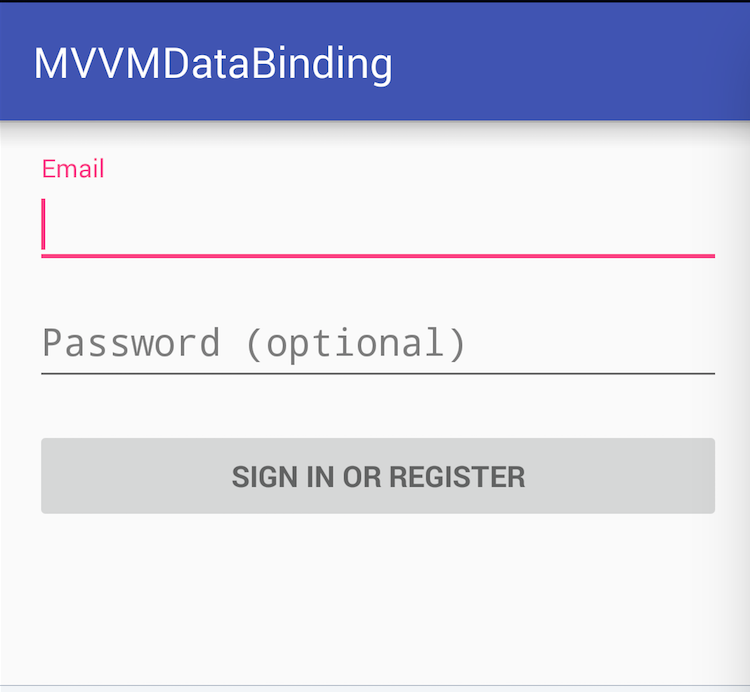
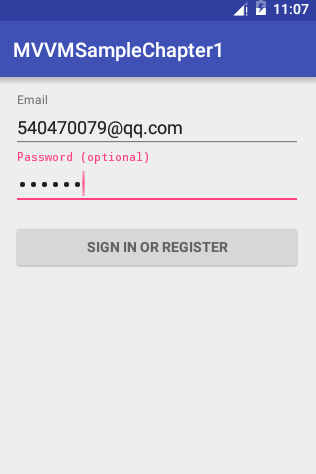
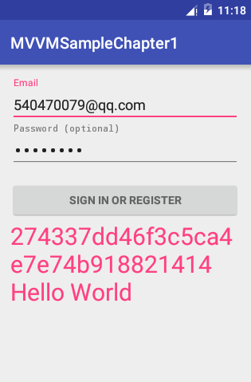

# Android中的MVVM

这一节我们来看看如何在Android的项目中运用MVVM。
先来看看Android中的MVC层级。我们在使用IDE创建一个Activity时，会默认帮我们创建一个xml布局文件。而我们从这两个文件的职责可以看出，Activity相当于Controller，xml布局文件相当于View。


明确层级关系后作为一个程序员，来通过经典的```Hello World```来演示一下，如何将MVC中的Controller的部分功能移植到MVVM中的ViewModel中。

###不一样的Hello World



如图一个登录界面，用户通过邮箱和密码进行登录验证，下面的登录按钮，需要等到email与password全部有输入后才会显示出来, 登录成功后显示用户的token，还有我们必不可少的```Hello World```。
我们可以先来看下符合MVC原则的原始部分代码。

###MVC代码
* Model:User类用来存储用户登陆后的信息数据。
```
public class User {
    private String email;//用户名email
    private String token;//登陆返回的token
    
    省略getter和setter方法
}
```
* View Android中主要是由xml文件来充当View显示布局。下面是登录显示界面布局

```
<LinearLayout xmlns:android="http://schemas.android.com/apk/res/android"
    xmlns:tools="http://schemas.android.com/tools"
    android:layout_width="match_parent"
    android:layout_height="match_parent"
    android:gravity="center_horizontal"
    android:orientation="vertical"
    android:paddingBottom="@dimen/activity_vertical_margin"
    android:paddingLeft="@dimen/activity_horizontal_margin"
    android:paddingRight="@dimen/activity_horizontal_margin"
    android:paddingTop="@dimen/activity_vertical_margin"
    tools:context="com.xuanpeng.mvvmsamplechapter1.LoginActivity">

    <!-- Login progress -->
    <ProgressBar
        android:id="@+id/login_progress"
        style="?android:attr/progressBarStyleLarge"
        android:layout_width="wrap_content"
        android:layout_height="wrap_content"
        android:layout_marginBottom="8dp"
        android:visibility="gone"/>

    <ScrollView
        android:id="@+id/login_form"
        android:layout_width="match_parent"
        android:layout_height="match_parent">

        <LinearLayout
            android:id="@+id/email_login_form"
            android:layout_width="match_parent"
            android:layout_height="wrap_content"
            android:orientation="vertical">

            <android.support.design.widget.TextInputLayout
                android:layout_width="match_parent"
                android:layout_height="wrap_content">

            <AutoCompleteTextView
                android:id="@+id/email"
                android:layout_width="match_parent"
                android:layout_height="wrap_content"
                android:hint="@string/prompt_email"
                android:inputType="textEmailAddress"
                android:maxLines="1"
                android:singleLine="true"/>

            </android.support.design.widget.TextInputLayout>

            <android.support.design.widget.TextInputLayout
                android:layout_width="match_parent"
                android:layout_height="wrap_content">

            <EditText
                android:id="@+id/password"
                android:layout_width="match_parent"
                android:layout_height="wrap_content"
                android:hint="@string/prompt_password"
                android:imeActionId="@+id/login"
                android:imeActionLabel="@string/action_sign_in_short"
                android:imeOptions="actionUnspecified"
                android:inputType="textPassword"
                android:maxLines="1"
                android:singleLine="true"/>

            </android.support.design.widget.TextInputLayout>

            <Button
                android:id="@+id/email_sign_in_button"
                style="?android:textAppearanceSmall"
                android:layout_width="match_parent"
                android:layout_height="wrap_content"
                android:layout_marginTop="16dp"
                android:text="@string/action_sign_in"
                android:textStyle="bold"/>
            <TextView
                android:layout_width="match_parent"
                android:layout_height="wrap_content"
                android:textColor="@color/colorAccent"
                android:textSize="30sp"
                android:id="@+id/token_show_text_view"/>
        </LinearLayout>
    </ScrollView>
</LinearLayout>
```
* Controller 中的代码比较多，大概在260行左右，其中包含了呈现View，获取用户交互，控制View的显示逻辑和登录网络请求等。


1. 先看看私有属性：
```
    /**
     * 登录请求Task，用于异步登录
     */
    private UserLoginTask mAuthTask = null;

    // 显示UI组件
    private AutoCompleteTextView mEmailView;
    private EditText mPasswordView;
    private View mProgressView;
    private View mLoginFormView;
    private Button mEmailSignInButton;
    private TextView mTokenTextView;

    //两个状态值，用于监听有没有文本输入
    private  boolean mhasEmailText = false;
    private  boolean mhasPasswordText = false;

    //存储登录成功后的数据
    private User loginUser = null;
```
其中根据两个状态值来控制登录按钮的显示。UserLoginTask是一个私有类，用于发送异步登录操作，并返回登录结果。

2. 接下来看看私有函数：
 其中分为三个**辅助函数**```isEmailValid, isPasswordValid, md5```,用于邮箱和密码的合法性认证，以及模拟生成token。
两个界面**处理函数**,
```
    /**
     * 根据两个状态值来控制登录按钮的显示
     */
    private void updateSignButton() {
        mEmailSignInButton.setVisibility(mhasEmailText&&mhasPasswordText ? View.VISIBLE : View.GONE);
    }
    /**
     * 登录时，显示Loading界面
     */
    private void showProgress(final boolean show) {
        ...
    }
```
一个**功能函数**，用于输入验证与发起异步登录请求。
```
private void attemptLogin() {
        if (mAuthTask != null) {
            return;
        }

        // Reset errors.
        mEmailView.setError(null);
        mPasswordView.setError(null);

        // Store values at the time of the login attempt.
        String email = mEmailView.getText().toString();
        String password = mPasswordView.getText().toString();

        boolean cancel = false;
        View focusView = null;

        // Check for a valid password, if the user entered one.
        if (!TextUtils.isEmpty(password) && !isPasswordValid(password)) {
            mPasswordView.setError(getString(R.string.error_invalid_password));
            focusView = mPasswordView;
            cancel = true;
        }

        // Check for a valid email address.
        if (TextUtils.isEmpty(email)) {
            mEmailView.setError(getString(R.string.error_field_required));
            focusView = mEmailView;
            cancel = true;
        } else if (!isEmailValid(email)) {
            mEmailView.setError(getString(R.string.error_invalid_email));
            focusView = mEmailView;
            cancel = true;
        }

        if (cancel) {
            // There was an error; don't attempt login and focus the first
            // form field with an error.
            focusView.requestFocus();
        } else {
            // Show a progress spinner, and kick off a background task to
            // perform the user login attempt.
            showProgress(true);
            mAuthTask = new UserLoginTask(email, password);
            mAuthTask.execute((Void) null);
        }
    }
```
3.  
