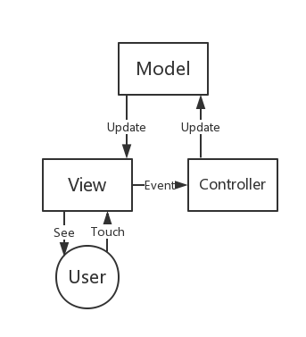

# Android中浅谈MVVM


### MVC
[MVC](https://en.wikipedia.org/wiki/Model%E2%80%93view%E2%80%93controller), 及Model-View-Controller，最早诞生于八十年代，在项目架构中明确表明了各个层级的业务逻辑关系，现在已经成为主流的客户端编程框架。简单回顾一下：


MVC中三者都有交互，并且三者形成一个闭环，这样的关系维护会略显复杂。稍有处理不当，会导致Controller代码的庞大,其中会大量混杂着界面与业务处理逻辑。

#####那问题来了，需要给Controller进行瘦身，如何来帮它减肥呢？
对于这个问题,只要牢记不重复可复用原则```Don't repeat yourself```,可以将Controller中可复用的内容抽离出来。
先来看看Controller中有哪些内容：


