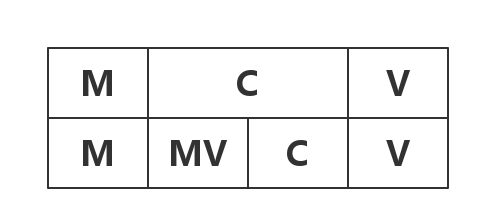
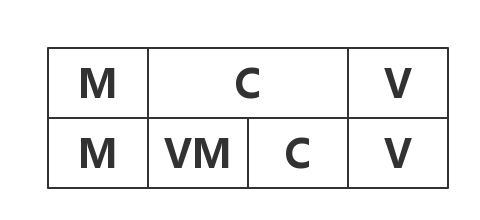

# 浅谈移动端的MVVM

### MVC
[MVC](https://en.wikipedia.org/wiki/Model%E2%80%93view%E2%80%93controller), 及Model-View-Controller，最早诞生于八十年代，在项目架构中明确表明了各个层级的业务逻辑关系，现在已经成为主流的客户端编程框架。简单回顾一下：


MVC中三者都有交互，并且三者形成一个闭环，这样的关系维护会略显复杂。稍有处理不当，会导致Controller代码的庞大,其中会大量混杂着界面与业务处理逻辑，导致代码可测试性与维护性降低。

#####那问题来了，需要给Controller进行瘦身，如何来帮它减肥呢？
对于这个问题,只要牢记不重复原则```Don't repeat yourself```，我们可以发现View和Model都是符合这种原则的,那么如何将Controller中可复用的内容抽离出来？
先来看看Controller中有哪些内容：
* 单个或者多个View之间显示与拼装
* 响应View事件
* 界面跳转
* 处理Model数据，提供给View显示


其中Model数据处理中，可能会包含：
* 发送网络服务调用，获取model
* 数据库操作，获取和保存model
* 根据业务逻辑处理已有Model数据
* ....

Controller的主要职责是担当View与Model之间的桥梁，而同一个项目中，复用View与Mode之间的联系需求比较少，那么这些内容中不可复用的部分主要是：
* 初始化构建View与Model
* 监听View的事件
* 界面跳转
* 监听Model的更新数据


而其中相对于View，比较独立的部分可以复用：
* 处理Model数据

#####下一个问题，如何组织抽离出来的部分呢？
也许我们可以从[MVVM](https://en.wikipedia.org/wiki/Model_View_ViewModel)中找出一些答案。


---

###MVVM
[MVVM](https://en.wikipedia.org/wiki/Model_View_ViewModel)全称Model-View-ViewModel。最早于2005年被微软的架构师John Gossman提出，并且在微软的软件开发中使用。而整整比MVC晚了20多年。



上面图中表明了MVVM的层级关系，可以看出它通过ViewModel层来打破MVC中的闭环，达到View与Model的耦合。

####关于ViewModel
 这个术语由于混合了我们已知的两个术语，会给读者带来一些困惑，但是它却是个完全不同的东西，它不是MVC中视图模型。它的职责：
 * 作为View显示所需的静态模型
 * 收集，解释和转换显示数据
 * 获取View的Event，更新处理相关Model业务


它也有一个更好的术语可能是"View Coordinator"，它从数据资源中（数据库，网络服务器等）中获取model，运用相关逻辑处理成view的展示数据。它暴露给View仅是需要显示的内容（理想状态下是不会直接将Model暴露给View）。它还负责监听View的交互事件，来对Model更改（比如更新数据库，服务器调用等。

MVVM通常还会使用双向绑定技术，这样可以使得Model与ViewModel，ViewModel与View之间的变化能直接的反馈出来。所以有时MVVM也被称为[Model-View-Binder](https://en.wikipedia.org/wiki/Model_View_ViewModel)。

####MVVM的缺点
* 数据绑定的使用使得Bug很难调试。因为数据绑定会使得一个位置的bug很快的传递到别的地方，要准确的找到错误源就不是那么容易的事情。
* 对于大型的项目，会耗费更多的内存。主要还是由于数据绑定和函数响应式编程等。

上面我们说明了MVVM的优缺点，接下来就是
#####如何利用MVVM来给我们的MVC进行瘦身呢？

---
###MVC中的MVVM
移动端中MVC中Controller承载的职能太多，需要将处理Model数据这部分分离出来。而我们可以利用MVVM中的ViewModel来承担这部分职能，还可以利用数据绑定的特性来快速的将数据反馈给View层来展示。


如图，我们在MVC中插入了VM层，来承载着原来Controller的部分职责，最后变成MVMCV(Model-ViewModel-Controller-View)模式。

现在Controller仅需要关注ViewModel的数据来管理各种各样的视图显示，并当视图有交互时，通知ViewModel来处理相关Model的处理业务。Controller不在需要了解数据库操作，网络请求，数据持久化，数据模型等。

ViewModel以属性的方式存在于Controller中，但是它不包含Controller，对Controller一无所知，将Model层完全与Controller层完全的隔离开来。

####总结下现有各个层次的主要职责:
* View：
* Controller：
* ViewModel：
* Model：


---
参考资料：