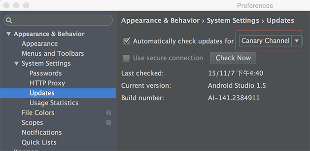

# 数据绑定

这篇文章准备简单介绍一下Data Binding Library以及如何在之前的Demo中使用。

## 简介
 今年的Google IO大会，给Android的开发人员带来了很多的[福利](http://www.androidchina.net/2734.html)。其中的[数据绑定（Data Binding library）](https://developer.android.com/tools/data-binding/guide.html)和MVVM息息相关，为Android UI开发中带入了数据绑定的特性，解决了UI编程中重复粘贴复制的痛点。
 
 Data Binding Library是support库，基本可以在所有的Android平台上使用，最低支持到Android2.1(API 7+)。
 
Android上数据绑定并非Google首创，在此之前[RoboBinding](http://robobinding.github.io/RoboBinding/getting_started.zh.html#_robobinding是什么)就已经实现了。（个人认为在现有项目中最好还是使用RoboBinding）。

###注意事项
* 该库还处在测试阶段，随时都有大面积更改的风险，并且可能包含bugs。
* Android Studio的开发界面支持不是很好。


##构建环境

* 准备Android Studio 1.3.0-beta1或者更高版本。


如图可以将Android Studio更新到最新的beta版本。

* 通过Android SDK Manager 下载最新的Android Support Repository,其中包含Data Binding Library。
* 在项目的build.gradle中添加依赖项,保证gradle和dataBinder插件都是最新的：

```
    dependencies {
        classpath 'com.android.tools.build:gradle:1.3.+'
        classpath 'com.android.databinding:dataBinder:1.+'
    }
```
由于上面的依赖项目目前在jcenter服务器上，需要确保repositories中包含jcenter：
```
allprojects {
    repositories {
        jcenter()
    }
}
```

